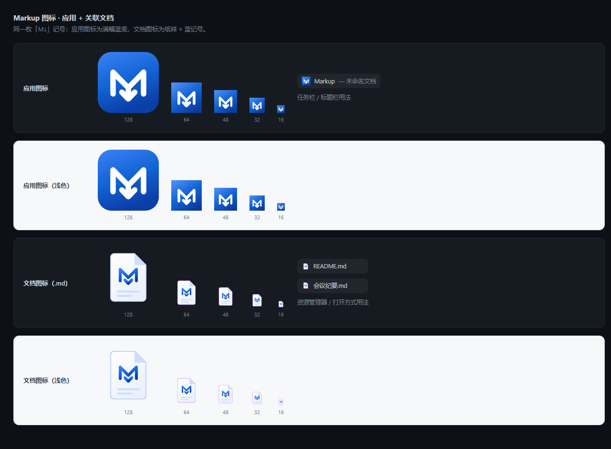

# Markup

> 离线优先的 Markdown 编辑器 —— **一套代码产出 Web / Electron / Tauri / Wails 四个壳**，界面与能力对齐 Typora。

<p align="center">
  
</p>

- **三视图**：实时预览（Milkdown / ProseMirror）、分屏（OverType）、源码（CodeMirror 6）——共用同一份 markdown 与**字符级选区偏移**，切换视图不丢光标、不置脏
- **多标签页**：脏点标记、拖拽重排、中键关闭、右键 6 项；`Ctrl+T` 新建 / `Ctrl+W` 关闭 / `Ctrl+Tab` 循环；关闭脏标签弹应用内确认；会话恢复（开启哪些标签、活动标签）
- **Typora 形制右键菜单**：图标行（剪切/复制/粘贴/删除）→ 复制·粘贴为 ▸（Markdown / HTML / 纯文本）→ 格式图标格（`B I </> 🔗` / `❝ • 1. ☑`）→ 段落 ▸ / 插入 ▸ / 视图 ▸；**应用内 7 节菜单栏**（文件/编辑/段落/格式/插入/视图/帮助）由 `menu.json` 单一源驱动，三壳原生菜单栏已隐藏避免重复
- **格式管线**：粗体 / 斜体 / 行内代码 / 删除线 / 链接（带输入弹窗）/ 标题 1-6 / 引用 / 无序·有序·任务列表 / 代码块；实时预览走 ProseMirror **原生命令**（Undo 正常），纯文本视图按行重写
- **富内容**：Mermaid 图（AntV X6 图形编辑 + Visimer 编辑序列/类/ER 图）、PlantUML（**离线 TeaVM 引擎**）、Draw.io / XMind / 30+ 格式文件预览（file-viewer，资产全离线自托管）、3D 模型（model-viewer）/ 视频 / 脑图（markmap）嵌入、公式（MathLive 输入 + KaTeX 渲染）、表格编辑（工具栏 + 对齐/移动/增删）
- **侧栏**：文件（工作区树 + 最近文件）/ 大纲 / 搜索，标签行与文档标签行**同高对齐**
- **插件系统**：`~/.markup/plugins` + 程序目录双根、权限门禁（`document`/`fs`/`dialog`/`config`）、热加载、12 个示例插件（模板库、开发工具、AI 助手/翻译摘要、文本工具箱、日记、TOC、反链、片段、选区统计、表格工具、链接检查）
- **导出**：独立 HTML（自包含、离线可读）/ PDF / 打印
- **HostAPI 抽象**：`packages/host-api` 定义 fs / dialog / config / window / clipboard / 事件 / 菜单，四壳各自实现，业务代码零分支

## 技术栈

| 层 | 选型 |
|---|---|
| 语言/构建 | TypeScript 7 · Vite 8（Rolldown/oxc）· pnpm 10 workspace |
| 编辑器内核 | Milkdown 7（ProseMirror 7）· CodeMirror 6 · OverType |
| Markdown 管道 | remark / rehype · KaTeX · Mermaid 12 |
| 图形 | AntV X6 · Visimer · markmap · flowchart.js · elkjs |
| 壳 | Electron 44（electron-builder / NSIS）· Tauri 2（Rust）· Wails 3（Go）· 纯静态 Web |

## 仓库结构

```
packages/host-api   壳能力契约 + menu.json（菜单单一源）+ 共享类型
packages/core       编辑器内核：视图适配器、DocStore、管道、embeds、textFormat、导出
packages/ui         shell 装配：侧栏/标签/设置/命令面板/右键菜单/菜单栏/主题/插件加载器
apps/web            Web 壳（静态站）
apps/electron       Electron 壳（主进程 + preload + renderer）
apps/tauri          Tauri 壳（Rust + 前端）
apps/wails          Wails 壳（Go + 前端）
examples/plugins    12 个示例插件（开发指南见 examples/plugins/README.md）
scripts             sync-menu.mjs（菜单同步）· make-icons.mjs（图标生成）· bundle-host-api.mjs · _needles.ps1（产物结构自检）
artifacts/          打包产物镜像（不入库）+ README.md（功能详解 / 已知问题）+ brand/（图标资产）
```

## 快速开始

```bash
corepack enable
pnpm install
pnpm dev:web          # http://localhost:5173
```

> 首次 `dev` 会由 vite 插件把 file-viewer 的 ~3000 个离线资产拷进 `public/file-viewer/`（慢盘 + 杀软下可能几分钟；服务会先起，拷贝在后台进行）。

## 构建四壳

```bash
pnpm build:web         # 静态站 → apps/web/dist
pnpm build:electron    # renderer + main + electron-builder → apps/electron/release/win-unpacked
pnpm tauri:build       # 需 Rust 工具链 → apps/tauri/src-tauri/target/release/markup.exe
pnpm wails:build       # 需 Go → apps/wails/markup-wails.exe
pnpm gen:menu          # 改动 menu.json 后同步三壳副本（各壳构建也会自动同步）
```

## 自检

```bash
pnpm -r typecheck                              # 7 个包
pnpm --filter @markup/core smoke               # 内核冒烟（管道/编辑器/嵌入/多标签/格式管线）
pnpm --filter @markup/ui smoke                 # UI 冒烟（设置/右键菜单/菜单栏/对话框/标签条/插件）
powershell -File scripts/_needles.ps1          # 产物结构断点（四壳 + 资产 + 菜单副本 + 图标接线）
```

CI 见 [`.github/workflows/build.yml`](.github/workflows/build.yml)（typecheck + 四壳构建，三平台矩阵）。

## 品牌标识

应用图标与 `.md` 关联文档图标在 [`artifacts/brand/`](artifacts/brand)：SVG 源 + `16/32/48/64/128/256/512` PNG + `.ico`。
生成链（零依赖、离线）：浏览器把 SVG 光栅化成母版 → `node scripts/make-icons.mjs <master.png> <outDir> [cropSide] [keyHex] [prefix]` 做 PNG 解码 / 面积重采样 / 打包 ICO。

<p align="center"></p>

## 已知问题

打包/平台限制、选型取舍（例如 drawio/xmind 导出退化为源码块、Wails 隐藏菜单栏后加速键改走渲染层、block 级格式在三种视图的不同实现）集中在 **[`artifacts/README.md`](artifacts/README.md)** 的「已知问题 / 后续」一节。

## 第三方许可

本项目 MIT，但打包产物内含以下组件（无 GPL-only 依赖；LGPL 组件仅以预编译二进制随包分发，且加载路径运行时可替换）：

- **MIT**：Milkdown、ProseMirror、CodeMirror、OverType、remark/rehype/unified、KaTeX、MathLive、Mermaid、markmap、flowchart.js、AntV X6、Visimer、React / React DOM、`beautiful-plantuml`、`avbridge`（视频扩展播放桥）、`@plantuml/core`（TeaVM 离线引擎）、`@ljheee/xmind-parser`、fflate、jszip（双许可，取 MIT）、`@wailsio/runtime`
- **Apache-2.0**：`@file-viewer/web-full` / `vite-plugin`（内含 pdf.js、draw.io viewer-static 等 Apache-2.0 资产）、`@google/model-viewer`、`@tauri-apps/api`（双许可）
- **EPL-2.0**（双许可，取 EPL-2.0）：elkjs
- **MPL-2.0**：mediabunny（`avbridge` 的容器封装与复用依赖）
- **ISC**：`libavjs-webcodecs-bridge`（avbridge 的 WebCodecs 桥）
- **LGPL-2.1-or-later**：libav.js（FFmpeg 的浏览器构建）。`avbridge` 仅在 `vendor/libav/` 下随包分发其预编译二进制（`webcodecs` 变体 + 自定义 `avbridge` 变体）；`packages/core` 播放前将其注入为 `globalThis.AVBRIDGE_LIBAV_BASE`，任何使用者都可改为自建的 libav 构建而不被锁定。许可文本与来源见 `node_modules/avbridge/NOTICE.md` / `THIRD_PARTY_LICENSES.md`
- 字体/资源：KaTeX 字体、MathLive 字体、pdf.js cmaps、libav.js WASM 等随包分发

各组件版权归其作者所有，许可证文本见 `node_modules/<pkg>/LICENSE`。

## License

[MIT](LICENSE) © 2026 KnightBlood
