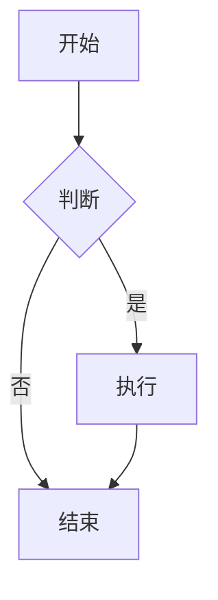
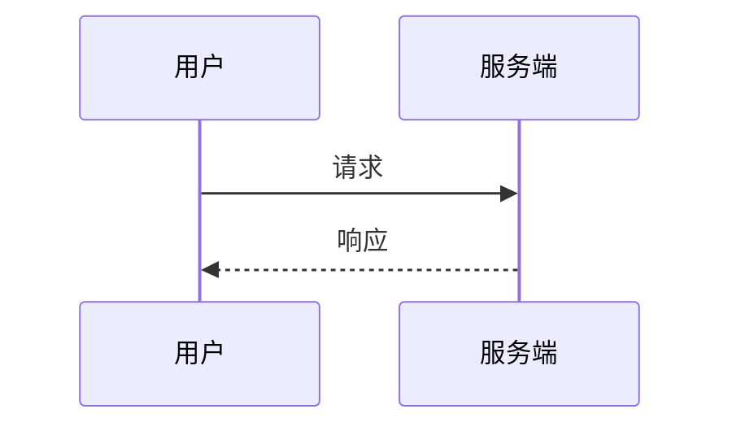

# 流程图冒烟样例

## Mermaid flowchart



## Mermaid sequence



## flowchart.js 语法

```flow
st=>start: 开始
e=>end: 结束
op=>operation: 处理
cond=>condition: 是否?

st->op->cond
cond(yes)->e
cond(no)->op
```

## 普通代码块（不应被拦截）

```js
console.log('plain fence stays source')
```
